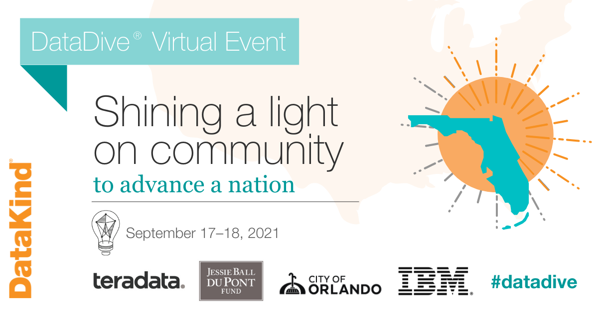
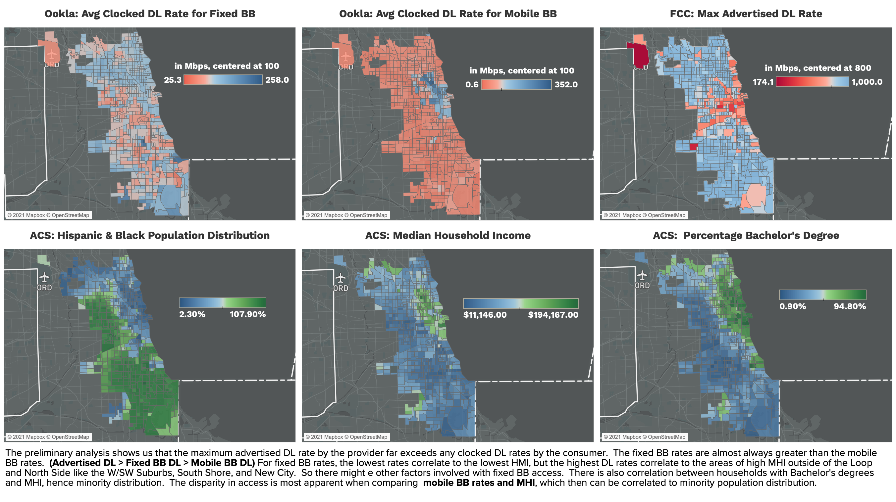

<h1>
DataKind CDAC Project 
by Steven Yan
</h1>

This is my personal repository of the coding for the various tasks outlined in the project.  Any coding was submitted and reviewed by DataKind Data Leads before submitting to the project organization.

# Overview:

DataKind DataDive events have an orientation session on Friday night for participants across the different time zones in the world.  However, coding doesn't officially begin until Saturday, but groups are coding together for all of Saturday and Sunday to present findings on Sunday late afternoon to the other participants.

There were three projects to select from:

1. **Housing Insecurity:** in conjunction with New America's FLH program, end-goal being to create an open-source set of tools to facilitate collection and analysis of evcition and mortgage foreclosure data
2. **Young Females Impacted by Justice System:** in conjunction with the Delores Barr Weaver Policy Center, which heavily relies on volunteers for data tasks, end-goal being to conduct a series of data extraction, visualization, and exploration tasks
3. **Broadband Access:**  in conjunction with CDAC at UChicago, explained below

DataKind provides the platform and resources for data scientists at any level of expertise to create the code necessary to perform the requested tasks.During the entire event, the volunteers are given support by the DataKind staff, and the staff ultimately present the findings where we are left to produce coding for the objectives.

# Objectives:

1. First Task Group
	- 1a.	To align Ookla data at the census trac level for Florida
	- 1b. Map the FCC and Ookla datasets at census tract level
	- 1c. For maps, visualize availability (FCC) / performance (Ookla) and access (ACS) for each state

2. Second Task Group
	- 2a. Conduct EDA on NYC Permit Dataset
	- 2b. What about other cities have similar open datasets for street construction permits related to internet fiber?
	- 2c. What additional open datasets can you find that may be relevat to exploring construction for internet fiber or 5B?

# Tableau visualizations:

# Roadmap:

# References:

# Contact Information:

 **Email:**  [datascisteven@gmail.com](mailto:datascisteven@gmail.com)

 **LinkedIn:**  [https://www.linkedin.com/in/datascisteven](https://www.linkedin.com/in/datascisteven)

 **Github:**  [https://www.github.com/datascisteven](https://www.github.com/datascisteven)

 **Medium:** [https://datascisteven.medium.com](https://datascisteve.medium.com)

